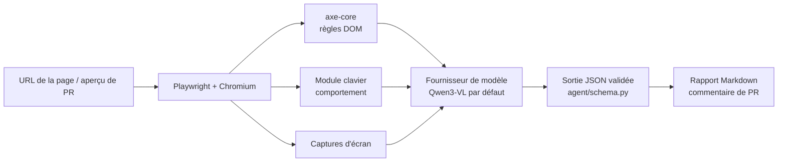

# Guide de continuation

Ce guide s'adresse aux équipes qui reprendront le projet lors d'une session
suivante. Objectif : être productif en une journée, sans avoir besoin de
contacter l'équipe précédente.

Lisez dans cet ordre : ce guide, puis `docs/decisions/` (pourquoi le projet
est construit ainsi), puis `docs/PROTOCOLE_EVALUATION.md`.

## 1. État du projet

Cette table est la **source unique** de l'avancement. Mettez-la à jour à
chaque fusion dans `main`.

| Étape | Contenu | État |
|---|---|---|
| Page de démo | 24 violations, page corrigée, vérité terrain validée | ✅ fait |
| Collecte axe-core | `agent/collect.py` | ✅ fait |
| Fournisseurs de modèles | `agent/fournisseurs.py`, garde-fou de licence, tests | ✅ fait (non testé contre un vrai modèle) |
| Navigation clavier | `agent/clavier.py` | ⬜ à faire |
| Prompts et analyse | `agent/prompts.py`, `agent/analyse.py` | ⬜ à faire |
| Rapport et CI | `agent/rapport.py`, `.github/workflows/` | ⬜ à faire |
| Évaluation comparative | `eval/evaluer.py` | ⬜ à faire |

## 2. Démarrage

Prérequis : Python 3.11+, Node.js 18+, Git, et [Ollama](https://ollama.com).
Matériel : environ 8 Go de mémoire GPU, ou 16 Go de RAM (plus lent) pour le
modèle 8B. Sur une machine modeste, utilisez `qwen3-vl:4b`.

```bash
git clone <url-du-depot> && cd a11y-agent
python -m venv .venv
source .venv/bin/activate            # Windows : .venv\Scripts\activate
pip install -r requirements-dev.txt
playwright install chromium
npm install                          # installe axe-core
ollama pull qwen3-vl:8b-instruct
cp .env.example .env                 # puis ajustez si besoin
```

Vérifiez que tout fonctionne :

```bash
python -m pytest -q                  # tests unitaires, sans modèle ni réseau
python eval/verifier_demo.py         # doit afficher « VÉRITÉ TERRAIN VALIDE »
```

## 3. Architecture



| Fichier | Responsabilité |
|---|---|
| `agent/collect.py` | Injecte axe-core, filtre les règles WCAG A/AA, simplifie le JSON |
| `agent/schema.py` | Schéma Pydantic de la sortie, commun à tous les modèles |
| `agent/fournisseurs.py` | Appels aux modèles ; refuse les modèles propriétaires hors évaluation |
| `demo/` | Pages de test et vérité terrain |
| `eval/verifier_demo.py` | Contrôle de cohérence de la vérité terrain |
| `docs/decisions/` | Décisions d'architecture (ADR) |

## 4. Tâches courantes

### Ajouter une violation à la page de démo

1. Ajoutez-la dans `demo/page_cassee.html`, **sans commentaire ni attribut qui
   la révèle** : le HTML est transmis aux modèles, un indice fausserait
   l'évaluation.
2. Ajoutez la version correcte dans `demo/page_corrigee.html`.
3. Documentez-la dans `demo/verite_terrain.json` avec un nouvel identifiant
   (`V25`…). Remplissez honnêtement `visible_capture`, `detectable_axe` et
   `detectable_clavier`.
4. Lancez `python eval/verifier_demo.py`. S'il signale une incohérence, c'est
   la vérité terrain qu'il faut corriger, pas le script.
5. Les images de la démo sont des SVG intégrés en base64 dans le HTML. Pour en
   modifier une, décodez-la, éditez le SVG, puis réencodez-la.

### Changer de modèle libre

1. Vérifiez sa licence sur la page du modèle **à la taille exacte** visée
   (Apache 2.0 ou MIT seulement).
2. Mettez à jour `docs/LICENCES.md` et, si le changement est durable, créez
   un nouvel ADR qui remplace l'ADR 0001.
3. Définissez `A11Y_MODELE_LIBRE` dans `.env`, puis relancez l'évaluation
   complète : un changement de modèle sans nouvelle mesure n'est pas accepté.

### Ajouter un fournisseur de modèle

1. Créez une sous-classe de `Fournisseur` dans `agent/fournisseurs.py` avec
   `nom`, `libre` et `analyser()`. Elle doit renvoyer une `Analyse` validée et
   des `Mesures`.
2. Ajoutez-la au dictionnaire `FOURNISSEURS`.
3. Ajoutez un test avec un client simulé dans `tests/test_fournisseurs.py`.
4. Si `libre = False`, son SDK va dans `requirements-comparaison.txt`.

## 5. Règles du projet

- **Modèles libres seulement** dans l'agent. Les modèles propriétaires ne
  servent qu'à la comparaison (ADR 0003).
- **Aucun secret dans le dépôt.** Les clés vont dans `.env` ou dans les secrets
  GitHub. Le dépôt est public.
- **Tout en français** : prompts, rapports, documentation, messages de commit.
- **Pas de modification de la vérité terrain pour améliorer un score.**
- Toute dépendance nouvelle passe par `docs/LICENCES.md`.
- Chaque fusion dans `main` passe les tests et la vérification de la démo.

## 6. Limites connues et pièges

- **axe-core accepte un placeholder comme nom accessible** : le champ courriel
  sans étiquette (V08) n'est pas détecté par axe, alors qu'il viole WCAG 3.3.2.
- **Le piège clavier bloque le parcours.** Sur la page cassée, un parcours avec
  Tab s'arrête dans la carte (V23). Le module clavier doit aussi parcourir la
  page à rebours depuis la fin (Maj+Tab) pour atteindre les éléments suivants.
- **Les exécuteurs GitHub gratuits n'ont pas de GPU.** Un modèle 8B y est très
  lent. Options : exécuteur auto-hébergé, modèle 2B/4B dans le CI, ou partie
  déterministe seule dans le CI.
- **Non-déterminisme des LLM**, même à température 0 : toujours plusieurs
  exécutions par configuration.
- La page de démo est statique. Une vraie application (SPA, états multiples,
  authentification) demandera un parcours des états de l'interface.

## 7. Pistes pour les sessions suivantes

- Analyse de plusieurs pages et d'applications à états (parcours de scénarios).
- Simulation de lecteur d'écran (arbre d'accessibilité de Playwright) pour
  vérifier l'ordre et le contenu des annonces.
- Intégration dans le même pipeline que les autres agents d'AQL (Projet #7 et
  suivants), avec un format de rapport commun.
- Comparaison avec d'autres outils libres (Pa11y, Lighthouse).
- Élargir la vérité terrain avec des sites publics volontairement inaccessibles.

## 8. Checklist de passation (fin de session)

- [ ] Table d'avancement (section 1) à jour
- [ ] `python -m pytest -q` et `python eval/verifier_demo.py` passent sur `main`
- [ ] Résultats d'évaluation archivés avec date, machine et versions des modèles
- [ ] ADR rédigé pour chaque décision structurante prise pendant la session
- [ ] Limites et pistes (sections 6 et 7) complétées
- [ ] Aucun secret ni fichier `.env` dans l'historique Git
- [ ] Lien vers le rapport d'équipe ajouté au README
